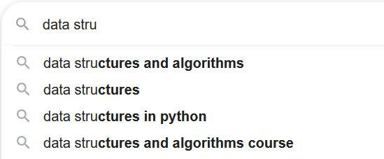

# Introduction to Data Structures and Algorithms

Every time you use the internet or most smart devices, your interactions are often handled by data structures and algorithms.  The same can be said for any electronic game you play, whether it's through a mobile device or a dedicated console.  For example, when you're performing a search online and you see possible queries pop up underneath as you type, like so:



Those results are saved in a data structure, which in this case is likely a trie.  (You'll learn about the trie data structure when we cover trees.)

When you submit a form to log in or register, a series of steps - or algorithms - are followed in order to process it and then authorize you to enter the site.  **Algorithms** are a series of steps are followed to usually process data and/or obtain a result.

This tutorial is meant to give you the tools to think about a problem, break down with the steps required to tackle it, and express your ideas to others who want to understand your thought process.  It will also talk about various tradeoffs, where memory may be an issue, or perhaps time is of utmost importance.  In system design tradeoffs become critical!

Regardless of if you seek to learn more as a novice to programming, come from a boot camp, need to pass a technical assessment, or require brushing up even with many years of experience in the industry, mastering data structures and algorithms is crucial to your growth as a developer!

## Why data structures and algorithms matter
- **Performance scales with users and data.**  Small inefficiencies are invisible on tiny inputs but become critical when systems serve millions of users or process terabytes of data.  Choosing the right structure or algorithm can mean the difference between a feature that feels instantaneous and one that is unusable.  
- **Resource constraints are real.**  Memory, battery, network bandwidth, and latency impose limits on what software can do.  Efficient algorithms reduce cost, power consumption, and infrastructure needs.  
- **You can make better decisions.**  Understanding algorithmic tradeoffs helps prioritize engineering effort, choose the right libraries, and design scalable systems rather than applying ad hoc fixes.
- **You can add new capabilities.**  Many features - such as searching, recommendations, and map routing - rely on algorithmic ideas and specialized data structures to be practical.  

## Prerequisites
- **Programming fundamentals (from any language of your choice):**
    - Variables and assigning values
    - Evaluating expressions 
    - Functions and methods, parameters and arguments, and returning values
- **Control flow:**
    - If/else (conditional) statements
    - For and while loops
    - Try/catch statements (or equivalent for error/exception handling)
- **Basic data types:**
    - Integers and floating decimals
    - Booleans
    - Strings
    - Arrays/lists
    - Objects or dictionaries/maps
- **Comfort writing small programs**:
    - Defining and calling functions, reading test input
    - Reading and understanding test input, along with returning results
    - Basic debugging, like going step by step or printing results
- **Development tools:**
    - Code editor (like Visual Studio Code or Cursor)
    - Running programs locally from the command line or IDE
    - Programming language of your choice installed (e.g. Python, JavaScript, Java, C++) 
    - Debugging and printing statements as needed

## Why pseudocode and design first
- **Pseudocode clarifies intent** before implementation and reduces language-specific mistakes; it makes the algorithm readable by people regardless of language background.  
- **Designing first avoids premature optimization** and helps find edge cases before writing code.  
- **Writing an algorithm in pseudocode helps with complexity reasoning** because control flow and data access patterns are explicit and easy to inspect.

## Practical tips for success
### Start early and practice often
- Maintain a consistent schedule when it comes to solving problems.  So solve 1-2 problems per day in 30 minutes to an hour, for example.  To reiterate: *consistency is key*!
- Start with easier problems, then gradually work up to more difficult challenges as you build up your skills and confidence.
- *Do NOT memorize code!*  Focus on *how* and *why* a solution works.

### Use clear pseudocode
- Write algorithms using English-like statements and consistent control constructs such as if statements, for/while loops, and return statements.  For example, when you're looking for the smallest value in an array in JavaScript:
```
FUNCTION findMinimum(inputArray) {
    LET minimum value;
    FOR (each value in the array) {
        IF (the current value in the array < minimum) {
            save the new value to the minimum variable;
        }
    }
    RETURN the minimum;
}
```
- Use descriptive names for variables and functions and CAPITALIZE control keywords for readability.
- Think like a computer!  In other words, imagine how the computer examines and processes data compared to how we humans do so.

### Think about complexity early
- Estimate time complexity by counting dominant operations and how they scale with input size.  For example, a loop is more often than not in $O(N)$ time.  Some nested loops might be $O(N^2)$ or higher, but it'll depend on the code.
- Estimate space complexity by tracking additional memory *beyond the input.*  For example, a variable that holds a single item, like a boolean or a number, is $O(1)$ space.  Do NOT consider the size of the input itself, like an array.

### Start with examples and edge cases
- Start with small, concrete examples by hand and trace your pseudocode from beginning to end.  Use a *T-diagram* to understand what's happening with the values of your variables. 
- Enumerate and test edge cases such as - *but not limited to* - empty inputs, minimal sizes, all-equal values, all-negative values, all-positive values, sorted/reverse-sorted sequences, and very large inputs.  *Pay close attention to the problem constraints* to understand what inputs are valid and invalid, as this will help you determine possible edge cases.

### Break problems into reusable components
- Design small helper functions with clear inputs, behavior, and outputs.  They're especially useful for operations that you repeat often.
- Build modular, testable pieces over monolithic code.  This makes your code much easier to organize and easier to change down the road, and improves scalability.

### Write tests and assertions
- Create unit tests for typical, boundary, and random cases.  
- Use assertions in code to catch incorrect assumptions early during testing.

### Learn by implementing multiple representations and measuring time
- Consider multiple ways to implement a data structure (e.g. linked lists vs. arrays for stacks) and multiple ways to solve the same problem to understand tradeoffs (e.g. solving a problem with $O(N^2)$ time and $O(1)$ space vs. $O(N)$ time and $O(N)$ space).
- Use simple benchmarks or timers to compare approaches on large inputs.

## Recommended study and reference resources
- GeeksforGeeks Pseudocode Guide and tutorials for data structures and algorithms: https://www.geeksforgeeks.org/dsa/what-is-pseudocode-a-complete-tutorial/  
- freeCodeCamp Data Structures and Algorithms overview and hands-on resources: https://www.freecodecamp.org/news/learn-data-structures-and-algorithms/  
- MIT OpenCourseWare Introduction to Algorithms course materials with lecture notes and assignments: https://ocw.mit.edu/courses/6-006-introduction-to-algorithms-spring-2020/
- CLRS textbook reference for deeper theoretical grounding: https://mitpress.mit.edu/9780262046305/introduction-to-algorithms/  

## Quick checklist before starting
- **Can write and run functions** that accept parameters and return results.  
- **Can use loops and conditionals** confidently to traverse and mutate data.  
- **Can design and read simple data structures** such as arrays, lists, and maps/sets.  
- **Can write pseudocode** that communicates an algorithm’s structure and intent.