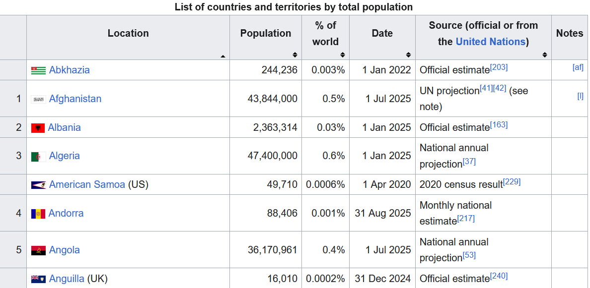
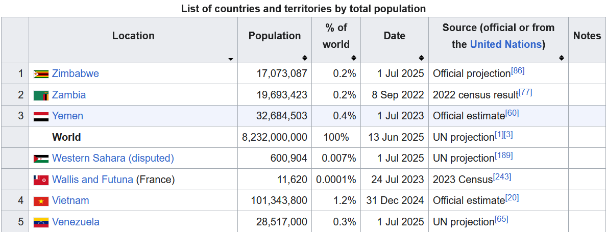

# Sorting
**Sorting** is the process of arranging data in a specified order.  Most of the time this means sorting in one of the following ways:
- Alphabetically from A to Z - or from Z to A
- Numerically from smallest to largest - or from largest to smallest
- Chronological order, i.e. from oldest to newest - or reverse chronological order, i.e. from newest to oldest

If you look at a page like [this one](https://en.wikipedia.org/wiki/List_of_countries_and_dependencies_by_population), which displays a table where you can sort countries by population, by name, by the date that the most recent estimate was obtained, etc., you will see the data sorted accordingly.  Below are some screenshots of the first few rows of data when sorted alphabetically and in reverse:
Starting with A:

Starting with Z:

## Big O time with real-life sorting
Methods that allow you to sort data vary widely by language, and their implementation will also vary.  Most of the time the sorting algorithm will take up $O(n\log(n))$ time.  There will be rare occasions when it might take $O(n^2)$ time in the worst case scenario or $O(n)$ time in the best case, but these are very infrequent, so you can usually assume $O(n\log(n))$ time.  

Go into real-life sorts in Java, JavaScript, C# and Python here!  Use Baeldung as one reference, and use others as well.

## What is a stable sort?
Talk about stable sorts

## Sorting in place vs. returning a new object
Sorting in place vs. returning a new array

## Types of sorts